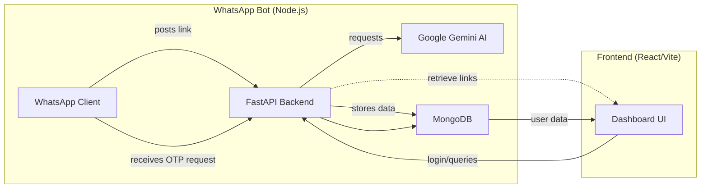

# Social Saver Bot 📱🧠

Social Saver Bot lets users save Instagram reels they receive on WhatsApp, analyze the caption using AI, and view categorized summaries on a web dashboard. It bundles a WhatsApp listener, a Python FastAPI backend, and a React/Vite frontend backed by MongoDB.

---

## 🚀 Features

- **WhatsApp Integration**: Bot listens for Instagram reel links in personal chats.
- **AI-Powered Caption Analysis**: Uses Google Gemini to classify and summarize captions.
- **Secure Storage**: Saves links and AI results in MongoDB.
- **User Dashboard**: Login via phone OTP, browse saved reels by category, search, delete.
- **OTP-based Authentication**: OTPs are sent over WhatsApp for a seamless login experience.

---

## 🧩 Architecture Overview



> Diagram: WhatsApp bot forwards links to the backend, which analyzes and saves them. The dashboard fetches stored links from the backend backed by MongoDB.

---

## 🛠️ Getting Started

### Prerequisites

- Node.js (>=18)
- Python 3.11+ with `venv`
- MongoDB URI (local or cloud)
- [Google Gemini API key](https://developers.google.com/).

### Environment Variables

Create a `.env` file in the project root with:

```env
MONGO_URI=<your_mongo_connection_string>
GEMINI_API_KEY=<your_gemini_api_key>
BOT_URL=<whatsapp_bot_url_or_local>
BACKEND_URL=<backend_url_for_bot_defaults_to_http://127.0.0.1:8000>
```

### Backend Setup (Python)

```bash
cd app
python -m venv ../venv311
# activate your venv (Windows)
# .\venv311\Scripts\activate
pip install -r ../requirements.txt
uvicorn app.main:app --reload
```

The backend exposes endpoints:

- `POST /webhook` – receives `{message, from_user}` from WhatsApp bot
- `POST /send-otp` – trigger OTP SMS via bot
- `POST /verify-otp` – validate OTP and return user data
- `POST /login` – optional phone-only login
- `DELETE /delete-link/{id}` – remove saved link


### WhatsApp Bot Setup (Node.js)

```bash
cd whatsapp-bot
npm install
# set BACKEND_URL env if needed
node bot.js
```

Scan the QR code (shown in logs) with your WhatsApp to authenticate. The bot listens for messages matching `https://instagram.com/reel/...` and posts them to the backend. It also handles OTP sending.

### Frontend Setup

```bash
cd frontend
npm install
npm run dev
```

Open `http://localhost:5173` (or the port shown) to access the dashboard. The login screen prompts for your WhatsApp phone; you'll receive an OTP via the bot.

---

## 📦 Directory Structure

```
app/                # FastAPI backend
  main.py
  routes/           # API routers (webhook, auth)
  services/         # AI helpers
  database/         # Mongo utils
frontend/           # React dashboard (Vite + Tailwind)
whatsapp-bot/       # Node.js code for WhatsApp listener & OTP sender
```

---

## 🧪 Usage

1. Start MongoDB and backend server.
2. Start the WhatsApp bot and authenticate by scanning the QR code.
3. Open the dashboard and log in with your WhatsApp number.
4. Send yourself or the bot a reel link on WhatsApp.
5. View categorized reel summary on the dashboard immediately.

---

## 🔒 Security Notes

- OTPs are stored temporarily in memory and cleared after verification.
- WhatsApp credentials are managed by `whatsapp-web.js` using `LocalAuth` (persisted locally).
- Ensure `.env` is kept out of source control.

---

## ✨ Contributions

Feel free to file issues or submit pull requests. Ideas:

- Support gallery/photo links
- Add user profiles
- Use Redis for OTP storage
- Deploy to Render, Vercel, or Heroku for auto-scaling

---

## 📜 License

MIT © 2024 Social Saver Bot
